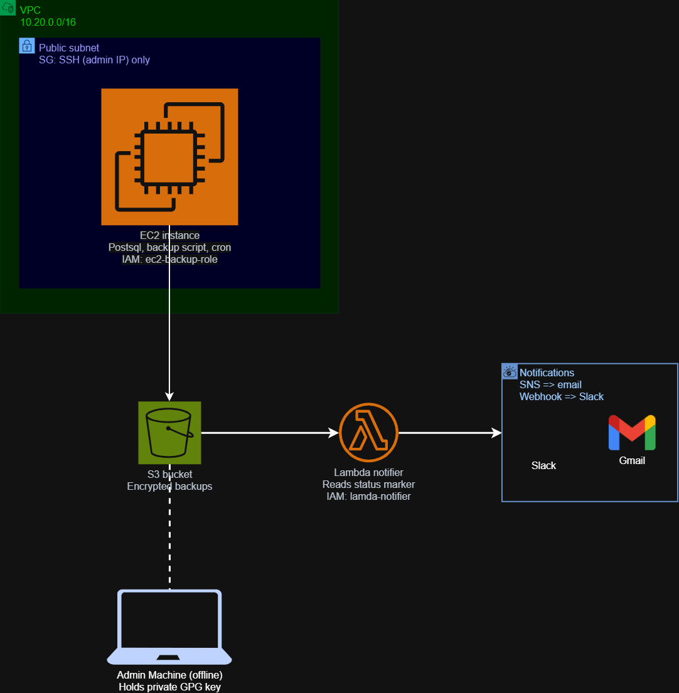

# Serverless Dynamic Backup & Notification Pipeline

A fully automated, encrypted PostgreSQL backup system on AWS, provisioned with Terraform and Ansible, with event-driven failure/success alerting via Lambda, SNS, and Slack.

## Architecture




A dedicated VPC hosts an EC2 instance running PostgreSQL, a Bash backup script, and a cron schedule. Each run dumps the database, compresses it, encrypts it with asymmetric GPG, and uploads it to S3. A status marker (success or failure) is written alongside every run. S3 triggers a Lambda function on any new status marker, which reads it and notifies both an SNS topic (email) and a Slack channel via webhook.

## Stack

- **Terraform** - all infrastructure, organized into modules (`networking`, `storage`, `notifications`, `iam`, `compute`, `lambda`)
- **Ansible** - provisions the EC2 instance: installs PostgreSQL, deploys the backup script and credentials, schedules cron
- **Bash** - the backup pipeline itself: dump, compress, encrypt, upload, report
- **Python (Lambda)** - reads status markers, publishes to SNS, posts to Slack
- **AWS services** - VPC, EC2, S3 (versioned, encrypted, lifecycle-managed), IAM, SNS, Secrets Manager, Lambda, CloudWatch Logs

## Key design decisions

- **Least-privilege IAM throughout** - the EC2 role can only `PutObject` to `backups/*` and `status/*`, nothing else; the Lambda role can only read those same prefixes, publish to one SNS topic, and read one secret.
- **Asymmetric GPG encryption** - the EC2 instance holds only the public key (can encrypt, can't decrypt); the private key never leaves the operator's machine. A compromised instance can't expose historical backups.
- **Defense in depth on S3** - IAM policy, bucket policy, and default server-side encryption all independently enforce the same constraints, so a misconfiguration in one layer doesn't expose the bucket.
- **Cost-tiered retention** - a lifecycle rule moves backups to Glacier at 30 days and expires them at 365, balancing recoverability against storage cost.
- **Failure is not silent** - the backup script always writes a status marker via a Bash `trap`, whether it succeeds or fails, so Lambda has something to react to either way.
- **Dedicated Terraform state backend** - state lives in its own versioned, locked S3 bucket, separate from the resources it manages.

## Repository structure

```
.
├── terraform/
│   ├── main.tf, variables.tf, provider.tf, outputs.tf
│   ├── terraform.tfvars          # non-sensitive project values
│   ├── secrets.tfvars            # gitignored - Slack webhook, admin IP
│   └── modules/
│       ├── networking/           # VPC, subnet, IGW, route table, security group
│       ├── storage/               # S3 buckets, lifecycle, bucket policy, notification trigger
│       ├── notifications/         # SNS topic, Secrets Manager secret
│       ├── iam/                   # EC2 instance role
│       ├── compute/                # EC2 instance, key pair
│       └── lambda/                 # Lambda function, IAM role, S3 trigger permission
├── ansible/
│   ├── playbook.yml
│   ├── inventory.ini
│   └── vars/secrets.yml           # gitignored - DB password
├── scripts/
│   └── backup.sh
├── iam/                            # source-of-truth IAM policy JSON, validated before Terraform
└── docs/
    └── WALKTHROUGH.md              # full build journey with screenshots
```

## Setup

1. Configure a dedicated AWS IAM user for Terraform (see `docs/WALKTHROUGH.md` for the exact permission set required).
2. Bootstrap the Terraform state bucket (local state first, then migrate - see walkthrough).
3. `terraform apply` to provision all infrastructure.
4. Generate a GPG keypair; import the public key onto the EC2 instance.
5. `ansible-playbook playbook.yml` to provision PostgreSQL, deploy the backup script, and schedule cron.
6. Confirm the SNS email subscription and verify a Slack webhook is active.
7. Trigger a manual backup to confirm the full pipeline before relying on the cron schedule.

Full step-by-step detail, including every issue encountered and how it was diagnosed, is in `docs/WALKTHROUGH.md`.