# Build walkthrough

A complete, reproducible guide to building this project from scratch - every command in order, with a screenshot slot after each meaningful step. Follow top to bottom to replicate the full pipeline.

---

## 0. Prerequisites

- AWS account with an admin/root identity available (needed once, to bootstrap a dedicated IAM user)
- Terraform, Ansible, AWS CLI, and GPG installed locally
- A Slack workspace where you can create an app

---

## 1. Design the IAM policies before any infrastructure exists

Write the trust policy and permissions policy for the EC2 role, and the trust/permissions policies for the Lambda role, as raw JSON under `iam/`. Validate syntax locally before anything is deployed:

```bash
for f in iam/*.json; do
  python3 -c "import json; json.load(open('$f'))" && echo "$f OK"
done
```

Screenshot: iam/ folder contents and validation output

---

## 2. Create a dedicated IAM user for Terraform

Using an existing admin identity:

```bash
aws iam create-user --user-name project3-terraform-deployer
aws iam create-access-key --user-name project3-terraform-deployer
aws iam attach-user-policy \
  --user-name project3-terraform-deployer \
  --policy-arn arn:aws:iam::aws:policy/PowerUserAccess
```

Configure a named CLI profile with the resulting keys:

```bash
aws configure --profile project3
```

Confirm:

```bash
aws sts get-caller-identity --profile project3
```

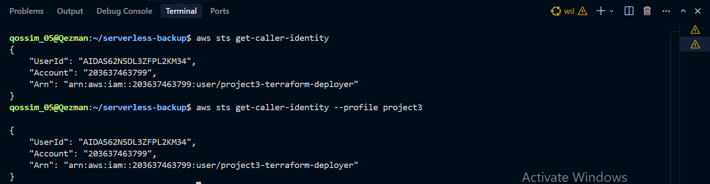

**Note:** `PowerUserAccess` deliberately excludes IAM management. This project also creates IAM roles via Terraform, so a scoped custom policy granting `iam:CreateRole`, `iam:PutRolePolicy`, `iam:CreateInstanceProfile`, etc. (scoped to `project3-`\* resource names) must be attached the same way, using the admin identity.

---

## 3. Bootstrap Terraform state

With no backend configured yet (local state), apply just enough to create the state bucket and lock file support:

```bash
cd terraform
terraform init
terraform apply -var-file="secrets.tfvars"
```

Once the state bucket exists, add the `backend "s3" {}` block to `provider.tf` and migrate:

```bash
terraform init -reconfigure
```

Confirm state now lives remotely and matches reality:

```bash
terraform plan -var-file="secrets.tfvars"
```

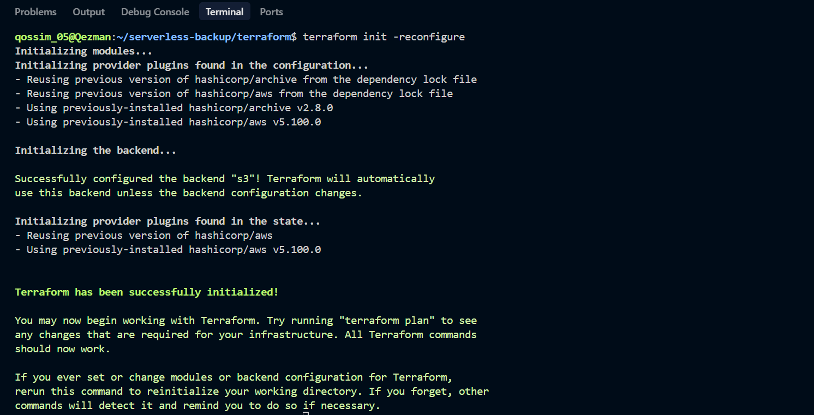

---

## 4. Apply networking, storage, notifications, and IAM modules

```bash
terraform apply -var-file="secrets.tfvars"
```

Screenshot: terraform apply output showing VPC, subnet, IGW, route table, security group, S3 buckets, SNS topic, and IAM role created

---

## 5. Set up Slack Incoming Webhooks

At **api.slack.com/apps** → Create New App → From scratch → name it, pick your workspace → **Incoming Webhooks** → toggle Activate → **Add New Webhook to Workspace** → authorize → copy the resulting URL.

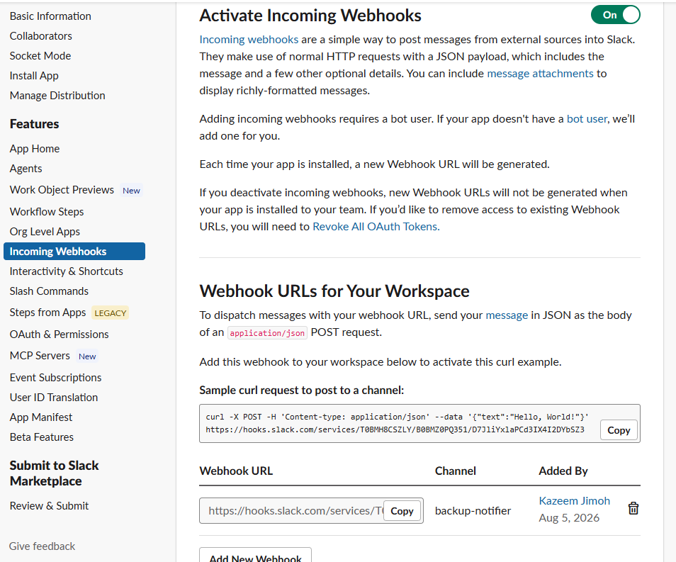

Add the URL to `terraform/secrets.tfvars` (gitignored, never committed):

```hcl
slack_webhook_url = "https://hooks.slack.com/services/..."
```

Apply so the secret reaches Secrets Manager:

```bash
terraform apply -var-file="secrets.tfvars"
```

---

## 6. Confirm the SNS email subscription

Check your inbox for the AWS confirmation email and click **Confirm subscription**. Verify:

```bash
aws sns list-subscriptions-by-topic \
  --topic-arn <your-topic-arn> \
  --profile project3
```

Should show a real ARN, not `PendingConfirmation`.

Screenshot: SNS subscription confirmed, ARN populated

---

## 7. Apply the compute module (EC2 instance)

```bash
terraform apply -var-file="secrets.tfvars"
```

Get the instance's public IP:

```bash
aws ec2 describe-instances \
  --filters "Name=tag:Name,Values=project3-vpc-backup-db" \
  --query "Reservations[0].Instances[0].PublicIpAddress" \
  --output text \
  --profile project3
```

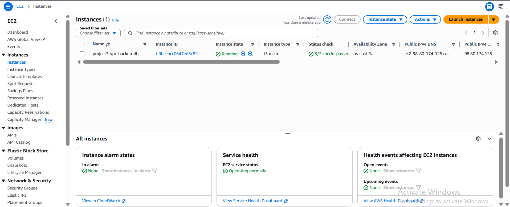

Screenshot: EC2 instance running in AWS console, IAM instance profile attached

---

## 8. Generate the GPG keypair and import the public key onto the instance

Locally:

```bash
gpg --full-generate-key
gpg --list-keys
gpg --export -a "your-email@example.com" > backup-public-key.asc
```

Copy the public key and connect via SSH:

```bash
scp -i ~/.ssh/project3-ec2-key backup-public-key.asc ubuntu@<PUBLIC_IP>:~/
ssh -i ~/.ssh/project3-ec2-key ubuntu@<PUBLIC_IP>
```

On the instance:

```bash
gpg --import backup-public-key.asc
gpg --list-keys
```

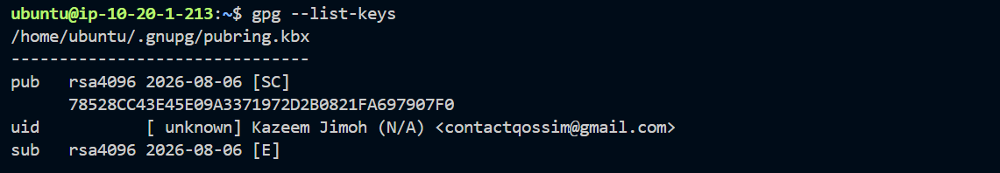

---

## 9a. Provision the instance with Ansible

Update `ansible/inventory.ini` with the current public IP, then from your local machine:

```bash
cd ansible
ansible backup_db -m ping
ansible-playbook playbook.yml
```

This installs PostgreSQL, creates the dummy database and scoped `backup_user` role, deploys `backup.sh` and its credentials file, and schedules cron.

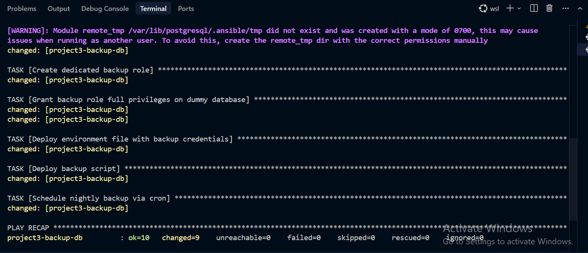

Screenshot: ansible-playbook run completing, all tasks ok/changed, failed=0

---

## 9b. Confirm AWS CLI and PostgreSQL client tools are present

The backup script needs both `aws` and `pg_dump` on the instance. If Ansible's package installs didn't cover them (or if testing on a fresh instance), install manually:

```bash
sudo apt update
sudo apt install -y awscli postgresql-client-16
```

Confirm both are available:

```bash
which aws
which pg_dump
```

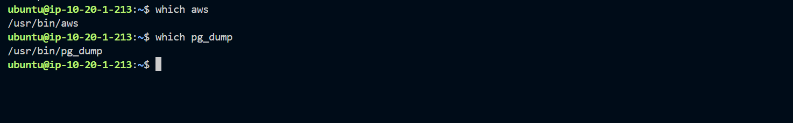

**Note:** ideally this belongs in the Ansible playbook itself (as an explicit `apt` task), not a manual step — if you're rebuilding this project, add `awscli` and `postgresql-client-16` to the playbook's package list so this step becomes unnecessary. It's documented here as a manual fallback because that's how it was actually discovered during the original build.

---

## 10. Manually test the backup script

On the instance:

```bash
export DB_BACKUP_PASSWORD="<your password>"
./backup.sh
```

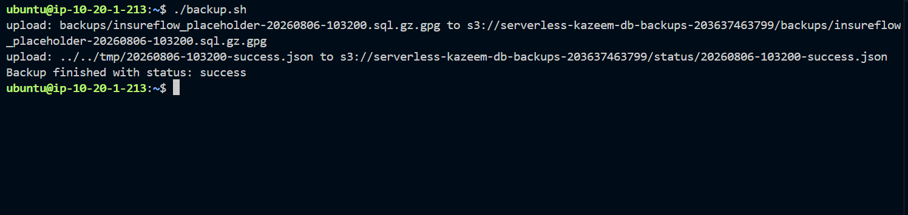

Confirm the files actually landed in S3:

```bash
aws s3 ls s3://<your-backups-bucket>/backups/
aws s3 ls s3://<your-backups-bucket>/status/
```

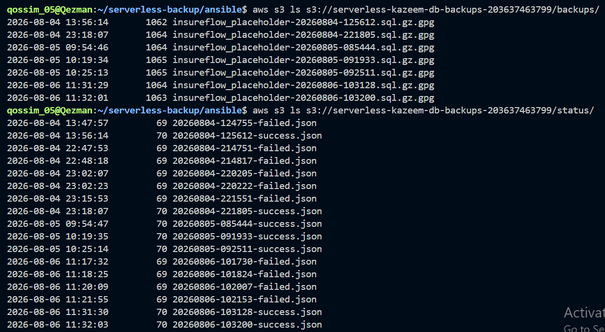

---

## 11. Apply the Lambda module and wire the S3 trigger

```bash
cd terraform
terraform apply -var-file="secrets.tfvars"
```

This deploys the notifier function, grants S3 invoke permission, and attaches the bucket notification rule.


---

## 12. End-to-end test

Trigger one more backup run on the instance, then check every downstream effect from that single run:

```bash
export DB_BACKUP_PASSWORD="<your password>"
./backup.sh
```

Lambda logs:

```bash
aws logs tail /aws/lambda/backup-notifier --profile project3 --since 5m
```

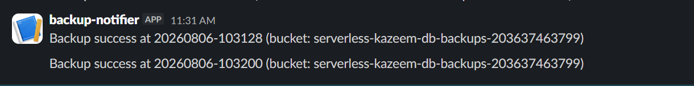

Screenshot: Slack message received in channel
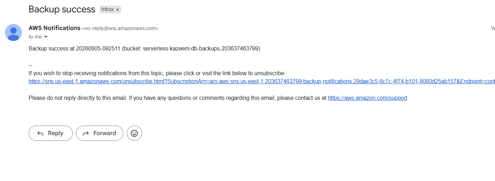

Screenshot:

---

## 13. Confirm the cron schedule is live

```bash
ssh -i ~/.ssh/project3-ec2-key ubuntu@<PUBLIC_IP> "crontab -l"
```

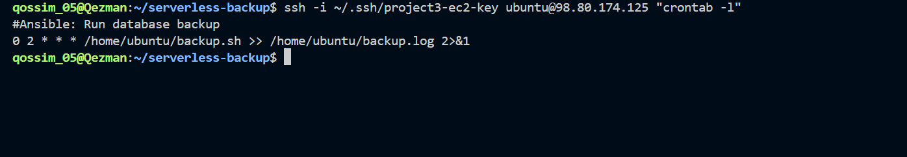

Screenshot:

At this point the pipeline runs unattended - no further manual triggers needed. The next morning, `aws s3 ls .../backups/` and `.../status/` should show a fresh object with no one having touched the instance.

---

## 14. Teardown (optional)

To avoid ongoing cost when the project isn't actively being demonstrated:

```bash
cd terraform
terraform destroy -var-file="secrets.tfvars"
```

**Note:** this deletes the S3 buckets and their contents (`force_destroy` not set - Terraform will refuse to destroy non-empty buckets unless you empty them first with `aws s3 rm s3://<bucket> --recursive`), the EC2 instance, and every other resource. State itself lives in the state bucket, which will also be destroyed - keep a local backup of `terraform.tfstate` if you intend to rebuild later without starting over.

---

## Lessons from debugging

- **Templated IAM policies need actual placeholders.** A `.tpl` file with a hardcoded value instead of `${variable_name}` will silently apply the wrong permissions - Terraform won't catch this, since it's valid JSON either way. Always verify the _live_ policy in AWS (`aws iam get-role-policy`), not just the source file.
- **EC2 public IPs change on replacement.** Without an Elastic IP, every instance replacement invalidates any hardcoded IP in SSH commands or Ansible inventory - always re-fetch the current IP rather than assuming.
- **S3 bucket policies can silently override IAM.** An explicit `Deny` in a bucket policy (e.g. requiring server-side encryption headers) blocks uploads even when IAM grants `PutObject` - the two layers are independent and both must agree.
- `terraform import` **matters more than it seems.** When infrastructure already exists in AWS but isn't in Terraform's state, importing (rather than letting `apply` try to recreate) avoids `BucketAlreadyOwnedByYou`-style conflicts and preserves existing resources.
- **Account/region migrations touch more than variables.** Moving a project to a new AWS account meant recreating the state backend, the IAM user and its permissions, the SSH key pair registration, and re-provisioning via Ansible - not just updating `.tfvars`.
